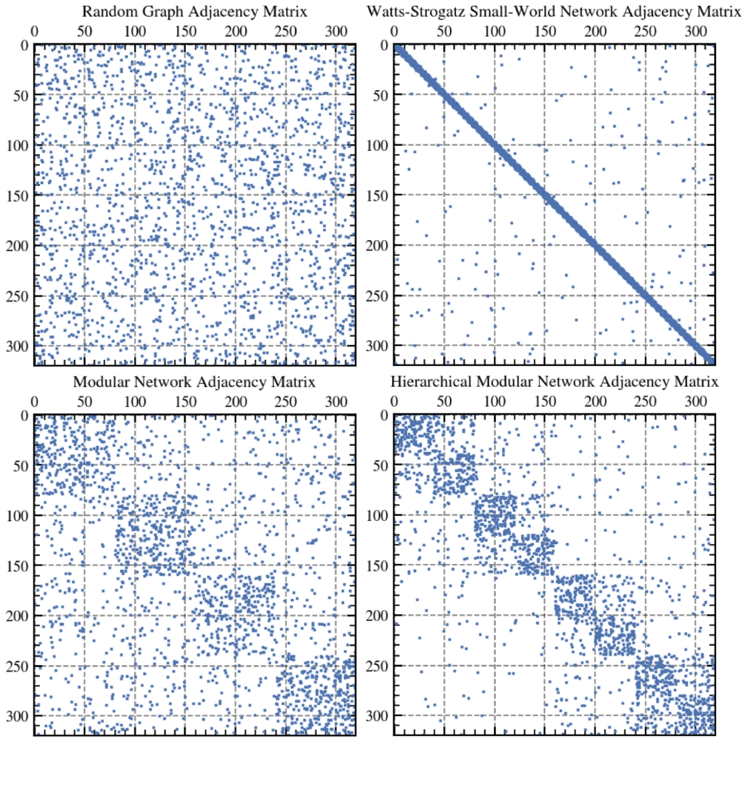
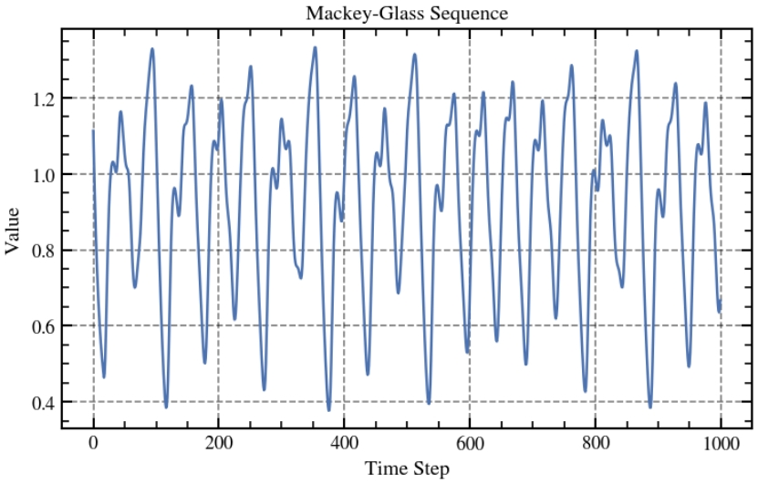
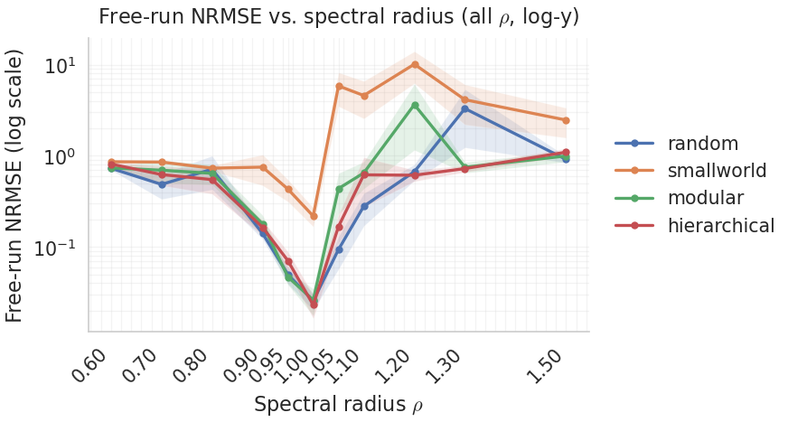

# 类脑储层计算（Reservoir Computing，RC）

**背景：**
储层计算（Reservoir Computing, RC）是一种受到了循环神经网络（RNN）启发的架构。一般来说，它会将输入信号输入到一个高维、非线性的动力学系统（即 reservoir 或储层），并通过线性读出层学习问题（Lukoševičius & Jaeger, 2009）。储层一般会由大量神经元通过循环连接构成，关键思想在于储层内部连接权重在初始化后保持固定，并在输入信息后产生丰富的动力学响应；而相应的，只有读出层（线性层）需要训练，从而显著降低训练难度与计算成本（Jaeger, 2001; Maass, Natschläger, & Markram, 2002）。

RC 的提出本身与大脑皮层的信息处理方式存在对应：
首先，皮层局部回路拥有密集的递归连接与丰富的瞬态动力学，可在输入扰动下形成多样的时空活动轨迹，使系统能够在一定时间窗内保留输入信息的痕迹，从而支持时间信息处理与短时信息保持（Buonomano & Maass, 2009）。
其次，大脑存在大量相对稳定的结构与连接背景，在此意义上，RC 可以作为一种大脑可塑性模型，储层对应相对稳定的微结构动力学，读出层对应快速适应的下游突触调整（Buonomano & Maass, 2009; Lukoševičius & Jaeger, 2009）。
除此以外，小脑也常被认为采取类似的架构，比如经典的 Marr–Albus 理论认为，颗粒细胞层（granule cell layer）能将输入扩展为更高维的表征，使下游浦肯野细胞层（Purkenje cell）实现更加简单的线性分离与映射（Marr, 1969; Albus, 1971）。

本实验将分为两部展开：
1. 通过 RC 模拟大脑在不同拓扑结构下的混沌边缘特性
2. 通过 RC 模拟工作记忆中的瞬态轨迹现象。

## 实验 1：

> **本实验 1 仅对应本仓库中的一个 notebook：`multiple motif esn.ipynb`**

**背景：**
**混沌边缘与类脑拓扑：**
混沌边缘 (Edge of Chaos, EoC)，指的是一个处于非线性动力系统在“有序－混沌”两种动力学相之间出现临界相变时所处的工作区间；在这个区间中，系统既不像有序相那样会把扰动迅速平息，也不像混沌相那样会对微小扰动迅速放大，而是呈现出一种稳定性与敏感性之间的平衡态，从而让系统更容易涌现出复杂的结构从而进行更有效率的计算（Langton, 1990）。
在 RNN 与 RC 中，EoC 之所以重要，是由于多项研究指出了随机循环网络在接近有序－混沌的临界相变处，其计算能力会显著优于其他区间（Bertschinger et al., 2004）。这点与神经科学中临界性（criticality）观点相呼应：皮层网络活动被观察到呈现“神经雪崩（neuronal avalanches）”等临界动力学特征，并与分支参数接近 1 的临界分支过程相联系，强调临界态可能在信息传递与稳定性之间实现平衡（Beggs & Plenz, 2003; Beggs, 2008）。一些实验与综述进一步讨论了在临界附近可能出现的功能优势，例如更大的动态范围、信息传输与容量提升等（Shew et al., 2009; Shew & Plenz, 2013）。

**实验 1** 着重于通过 RC 建模大脑的混沌边缘特性，以及不同的类脑拓扑学对 RC 混沌边缘与性能的影响。本实验将全程使用 ESN（Echo State Network 回声状态网络）框架（Jaeger, 2001）。

### ESN 动力学

* reservoir 状态更新（tanh 单元，标量输入）：
    $$x_{t+1} = \tanh(W_{res} x_t + W_{in} u_t)$$
* 读出层（线性读出；训练用线性回归/岭回归）：
    $$\hat{y}\_t = w\_{out}^T x\_t + b$$

**变量定义：**
* $N$：储层神经元数。
* $x_t \in \mathbb{R}^N$：时间 $t$ 的储层状态向量。
* $u_t \in \mathbb{R}$：时间 $t$ 的输入标量。
* $W_{res} \in \mathbb{R}^{N \times N}$：循环权重矩阵（固定不训练）。
* $W_{in} \in \mathbb{R}^{N \times 1}$：输入到 reservoir 的投影权重。
* $\hat{y}_t \in \mathbb{R}$：时间 $t$ 的模型输出（本实验输出为一维标量）。
* $w_{out} \in \mathbb{R}^N$：读出层权重向量（需要训练）。
* $b \in \mathbb{R}$：读出层偏置项（需要训练）。

### 类脑拓扑（Multi-Motif）设计

图1

大脑网络呈现小世界、模块化、分层模块化等结构特征，本实验在 **相同储层规模 N 与平均度约束** 下，生成四种拓扑。其动机是用拓扑结构作为操控变量，观察结构如何改变动力学与性能。
我们构造四种类脑网络拓扑（multi-motif reservoir）并与基线对比：
* **随机稀疏图（baseline）（图 1 左上）**：以目标平均度 `k_target`（默认为 6） 生成稀疏随机邻接矩阵，作为 ESN baseline。
* **Watts–Strogatz 小世界网络（图 1 右上）**：用参数 `p_rewire` 控制从规则环到随机图的重连程度。
* **模块化网络（stochastic block style）（图 1 左下）**：将节点分到多个模块，模块内连接概率高、模块间概率低。
* **分层模块化网络（hierarchical modular）（图 1 右下）**：在模块化基础上进一步引入层级：大模块（level-1）下嵌套小模块（level-2），并允许跨层级稀疏连接（参考 Milisav, F., et al.，2025）。网络在小尺度上先形成若干高密度子团簇（强局部回路），这些子团簇再被更稀疏的连接打包成更大的模块，层层嵌套。直观上它同时提供局部的强循环和跨层级的稀疏连接，因此更容易产生多时间尺度的状态演化。

### 混沌边缘与谱半径扫描：
在 ESN 中，谱半径 $\rho$（$W_{res}$ 特征值最大模）常被用作调控动力学强度的旋钮：
* $\rho$ 小：状态收缩更强，历史影响衰减更快；
* $\rho$ 大：更容易进入不稳定/强混沌区；
* $\rho$ 在相变附近：许多工作指出信息存储与信息传递可能同时更强，从而使计算更有效。

实验 1 设置：通过 `RHO_list = [0.6, …, 1.5]` 扫描，并在每个条件下重复 `N_seed = 10` 次（不同随机种子），最终确定混沌边缘对应的 $\rho$ 值位置。

### 具体参数：

* `N = 640` # 神经元数量
* `k_target = 6` # 平均连接数 调控稀疏度
* `W_in_scale = 0.1` # 输入权重缩放 控制输入强度
* `RHO_list = [ 0.6, 0.7,0.8, 0.9, 0.95, 1.0, 1.05, 1.1, 1.2, 1.3, 1.5]`
* `N_seed = 10` # 不同的随机种子数 即每个条件重复几次
* `T_train = 2000` # 训练时间步长
* `T_test = 2000` # 测试时间步长
* `T_washout = 200` # 洗牌时间步长 # 用于消除初始状态的影响
* `HORIZON = 84` # Mackey glass 的自由预测步数 (Mackey-Glass 经典标准是 84)(取自 Wringe et al., 2024)
* `REG = 1e-6` # 岭回归正则化系数 (Ridge Regression Lambda)

### 任务与评估指标：
MG 序列 / Mackey–Glass 序列 是一个具有复杂非线性和混沌特性的标量时间序列，常被用来测试时间序列预测性能。
评估指标是预测的 NRMSE（归一化均方根误差）（取自 Jaeger 2004）。

图2

### 任务结果

| 拓扑 | 最优 $\rho$（BEST） | NRMSE（mean ± std） | 备注 |
| :--- | :---: | :--- | :--- |
| **hierarchical** | 1.00 | 0.023113 ± 0.021026 | 四者最低 |
| **random** | 1.00 | 0.025568 ± 0.016626 | 接近最优 |
| **modular** | 1.00 | 0.026210 ± 0.027115 | 均值略高、波动略大 |
| **smallworld** | 1.00 | 0.218182 ± 0.160648 | 明显最差、方差也大 |

图3

 $\rho$ 集合经过10轮离散扫描，四种拓扑的 NRMSE 均在 $\rho = 1.00$ 处达到最佳。如图3所示，当 $\rho < 1$ 时网络整体更收缩，状态更快遗忘输入历史，NRMSE 相对更高；当 $\rho > 1$ 时增益偏强，数值极不稳定，误差严重上升，表明进入混沌态。总体来说除了小世界网络效果最差以外，其他三种拓扑误差非常接近：

* **hierarchical**：表现最好，最优点在 $\rho = 1.00$ ，NRMSE = 0.0231 ± 0.0210。均值最低，但标准差和均值同量级，说明不同 seed 下波动不小（有些 seed 很好，有些一般）。
* **random**：次优且很接近 hierarchical， $\rho = 1.00$  时 0.0256 ± 0.0166。均值略高于 hierarchical，但标准差更小一些，整体更稳一点。
* **modular**：与 random 几乎一个水平， $\rho = 1.00$  时 0.0262 ± 0.0271。均值接近，但标准差最大，对随机初始化更敏感。
* **smallworld**：明显最差， $\rho = 1.00$  时 0.2182 ± 0.1606。均值比另外三种高了一个数量级左右，且波动大。

**实验 1 总结**
本实验成功通过谱半径 $\rho$ 的离散扫描，找到各拓扑在当前设置下的最优工作点（均落在  $\rho = 1.00$ ），并复现了非线性系统临界态的性能优势，并在类脑拓扑上进行了测试。同样的工作点下，small-world 的 NRMSE 均值高一个数量级且方差巨大，而 hierarchical / random / modular 三者都能稳定到 0.02–0.03 的水平。这说明 small-world 在当前的生成参数与稀疏度设定下，产生的 reservoir 状态对 MG free-run 不可读出或不可维持。在成功的三类结构里，hierarchical 的均值最低、random 次之、modular 均值相近但 std 最大。层级模块化可能提供更合适的多尺度回路，使状态既能保留信息又不容易失控；模块化结构对随机初始化更敏感，导致性能不稳定。总之，这组结果支持“结构会显著改变 储层的可用性与稳定性”，并且 small-world 的表现暗示了类脑结构拓扑是否带来优势，取决于它在具体参数化下给出的动力学形态。

# 实验 2

**引用**
* Albus, J. S. (1971). A theory of cerebellar function. Mathematical Biosciences, 10(1–2), 25–61.
* Beggs, J. M. (2008). The criticality hypothesis: How local cortical networks might optimize information processing. Philosophical Transactions of the Royal Society A: Mathematical, Physical and Engineering Sciences, 366(1864), 329–343.
* Beggs, J. M., & Plenz, D. (2003). Neuronal avalanches in neocortical circuits. The Journal of Neuroscience, 23(35), 11167–11177.
* Bertschinger, N., Natschläger, T., & Legenstein, R. A. (2004). At the edge of chaos: Real-time computations and self-organized criticality in recurrent neural networks. In Advances in Neural Information Processing Systems (Vol. 17).
* Buonomano, D. V., & Maass, W. (2009). State-dependent computations: Spatiotemporal processing in cortical networks. Nature Reviews Neuroscience, 10(2), 113–125.
* Cheng, C., Jia, S., Liu, H., Zhao, X., Li, C. T., & Xu, B. (2025). Recurrent neural networks with transient trajectory explain working memory encoding mechanisms. Communications Biology, 8, 137. https://doi.org/10.1038/s42003-024-07282-3
* Jaeger, H. (2001). The “echo state” approach to analysing and training recurrent neural networks (GMD Report 148).
* Langton, C. G. (1990). Computation at the edge of chaos: Phase transitions and emergent computation. Physica D: Nonlinear Phenomena, 42(1–3), 12–37.
* Lukoševičius, M., & Jaeger, H. (2009). Reservoir computing approaches to recurrent neural network training. Computer Science Review, 3(3), 127–149.
* Maass, W., Natschläger, T., & Markram, H. (2002). Real-time computing without stable states: A new framework for neural computation based on perturbations. Neural Computation, 14(11), 2531–2560.
* Marr, D. (1969). A theory of cerebellar cortex. The Journal of Physiology, 202(2), 437–470.
* Milisav, F., et al. (2025). Neuromorphic hierarchical modular reservoirs. bioRxiv.
* Shew, W. L., & Plenz, D. (2013). The functional benefits of criticality in the cortex. The Neuroscientist, 19(1), 88–100.
* Shew, W. L., Yang, H., Petermann, T., Roy, R., & Plenz, D. (2009). Neuronal avalanches imply maximum dynamic range in cortical networks at criticality. The Journal of Neuroscience, 29(49), 15595–15600.
