# 基于瞬态循环神经网络的工作记忆模型：模拟延迟匹配任务中的瞬态轨迹

## 项目简介

本项目设计并实现了一个基于瞬态循环神经网络（TRNN）的储备池计算模型，用于模拟和解释工作记忆中的瞬态轨迹现象。模型在气味延迟配对关联任务（ODPA）上进行了系统性的超参数搜索和网络结构比较，揭示了自抑制机制对产生高质量瞬态轨迹的关键作用。

## 背景与动机

### 神经科学背景

工作记忆是认知功能的核心，涉及信息的短暂保持和操作。传统理论认为工作记忆依赖于持续性的神经活动，但近年来的研究发现，许多脑区（如前额叶皮层）在工作记忆延迟期表现出瞬态轨迹模式：神经元活动在延迟期内呈现动态变化，而非简单的持续放电。

这种瞬态轨迹具有以下特征：
- **时间序列性**：不同神经元在不同时间点达到峰值
- **稀疏性**：只有部分神经元在特定时刻活跃
- **阶梯传递**：活动模式在神经元间有序传递

### 计算模型动机

传统的循环神经网络（RNN）难以自然地产生这种瞬态轨迹。TRNN通过引入**自抑制机制**和**适应性变量**，能够自然地产生瞬态轨迹，为理解工作记忆的神经机制提供了计算模型基础。

## 模型设计

### TRNN动力学方程

TRNN的核心动力学由以下方程描述：

```
r_t = (1 - α_r) · r_{t-1} + α_r · [ReLU(W_res · r_{t-1} + W_in · u_t + noise) - γ · V_{t-1}]
V_t = (1 - α_v) · V_{t-1} + α_v · (m · r_{t-1})
```

其中：
- **r_t**: 神经元放电率（firing rate）
- **V_t**: 适应性变量（adaptation variable），累积历史活动
- **α_r**: 放电率更新率（leakage rate）
- **α_v**: 适应性变量更新率
- **γ**: 自抑制强度（self-inhibition strength），关键参数
- **m**: 适应性积累速率
- **W_res**: 循环连接权重矩阵
- **W_in**: 输入权重矩阵

### 关键机制

1. **自抑制项（-γ·V）**：随着神经元活动，适应性变量V累积，产生自抑制，导致活动自然衰减，形成瞬态轨迹
2. **模块化网络结构**：采用分层模块化储备池（Hierarchical Modular Reservoir），模拟大脑的模块化组织

### 网络结构

- **神经元数量**: 600
- **模块化结构**: [10, 5]（两层模块化）
- **连接稀疏度**: 目标度 k_target = 6
- **光谱半径**: ρ（可调，通常0.8-1.2）

## 任务设计：ODPA任务

### 任务结构

ODPA（Odor Delayed Paired Association）任务模拟了工作记忆中的延迟匹配任务：

1. **Fixation阶段**（10步）：注视期，无刺激输入
2. **Sample阶段**（10步）：呈现样本气味（A或B）
3. **Delay阶段**（30步短延迟/60步长延迟）：无刺激，需要保持记忆
4. **Test阶段**（10步）：呈现测试气味，需要判断是否与样本匹配

### 输入编码

使用**Von Mises调谐曲线**对气味进行编码：
- 24个输入神经元
- 气味A编码为角度0，气味B编码为角度π
- 确保输入在高维空间中可分离

### 评估指标

1. **任务准确率**：Match/Non-match判断的准确率
2. **瞬态指数（Transient Index, TI）**：衡量延迟期内瞬态轨迹质量
   - **E (Entropy)**：峰值时间分布的熵，衡量时间分散度
   - **R (Ridge-to-Background)**：峰值强度与背景活动的比值
   - **P (Proportion)**：峰值在延迟期内的神经元比例
   - **TI = E + R + P**

## 实验设置

### 超参数搜索

对以下参数进行了网格搜索：

- **光谱半径 ρ**: [0.8, 0.9, 0.95, 0.98, 1.0, 1.2]
- **自抑制强度 γ**: [0.0, 0.2, 0.5, 0.8, 1.0, 1.2, 1.5]
- **更新率 α_r**: [0.1, 0.2, 0.3, 0.4, 0.5, 0.6, 0.7, 0.8]

### 训练与测试

- **训练轮次**: 400 trials（短延迟3s）
- **测试轮次**: 100 trials
- **泛化测试**: 短延迟训练，长延迟测试（评估记忆保持能力）

### 网络结构对比

- **模块化网络**: 分层模块化结构 [10, 5]
- **随机矩阵网络**: 随机连接模式

## 实验结果与分析

### 1. 超参数搜索结果

#### 低α_r（0.1-0.5）情况

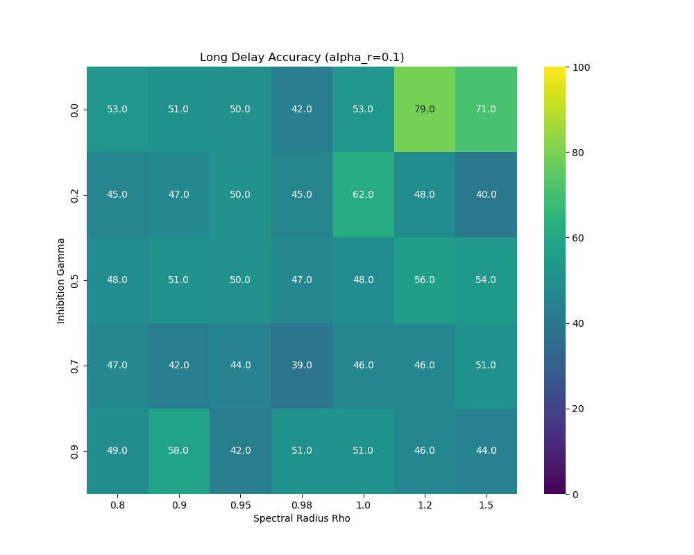

**关键发现**：
- **Gamma抑制项**：低α_r对应低Gamma抑制项，性能在γ=0时达到最大
- **光谱半径**：ρ较大时（>1）性能较好，短延迟任务表现优于长延迟
- **动力学表现**：出现明显的混沌放电现象

**示例结果**（α_r=0.1, ρ=1.2, γ=0.0）：
- 短延迟准确率：98%
- 长延迟准确率：67%
- TI值：1.52

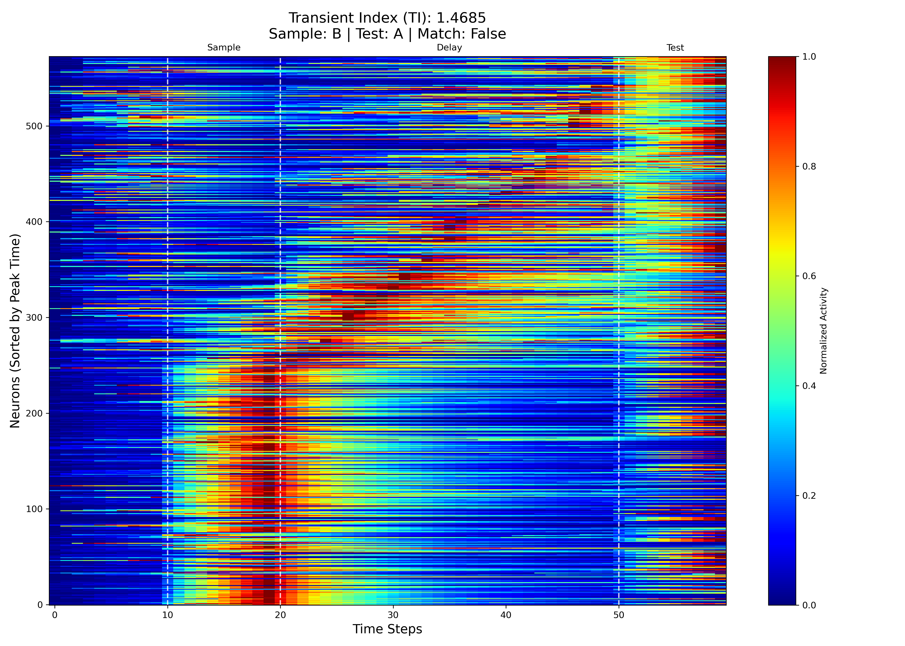

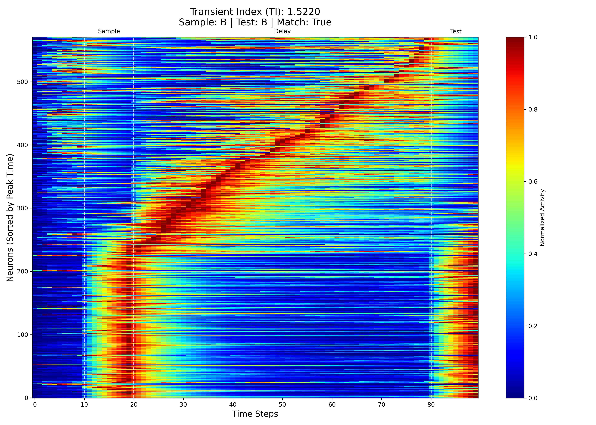

#### 高α_r（0.6-0.8）情况

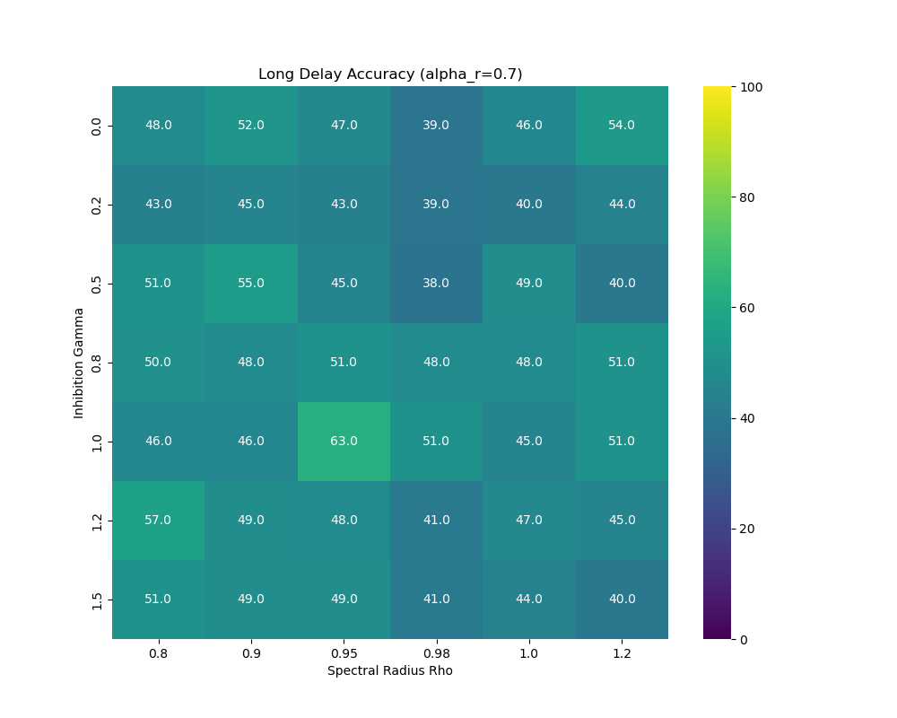

**关键发现**：
- 需要ρ≈0.95（临界混沌状态）和高γ值（>0.5）才能达到较好性能
- **反直觉现象**：模型在长延迟任务上表现优于短延迟任务
- **动力学表现更优**：出现稀疏放电和阶梯传递模式

**示例结果**（α_r=0.7, ρ=0.95, γ=1.0）：
- 短延迟准确率：46%
- 长延迟准确率：58%（**长延迟更好！**）
- TI值：1.55（更高）

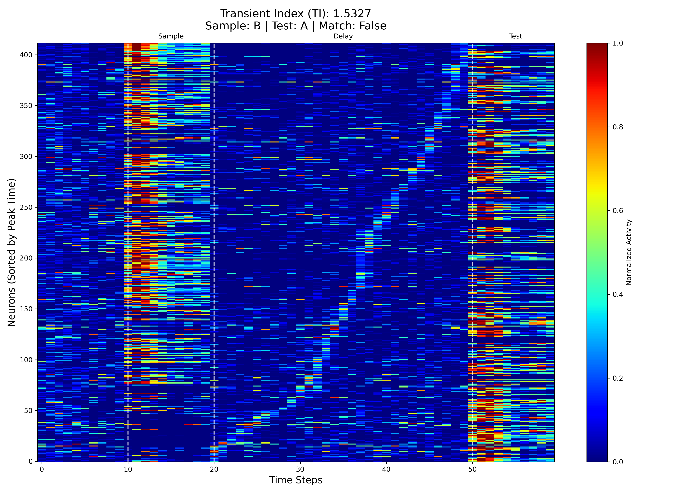

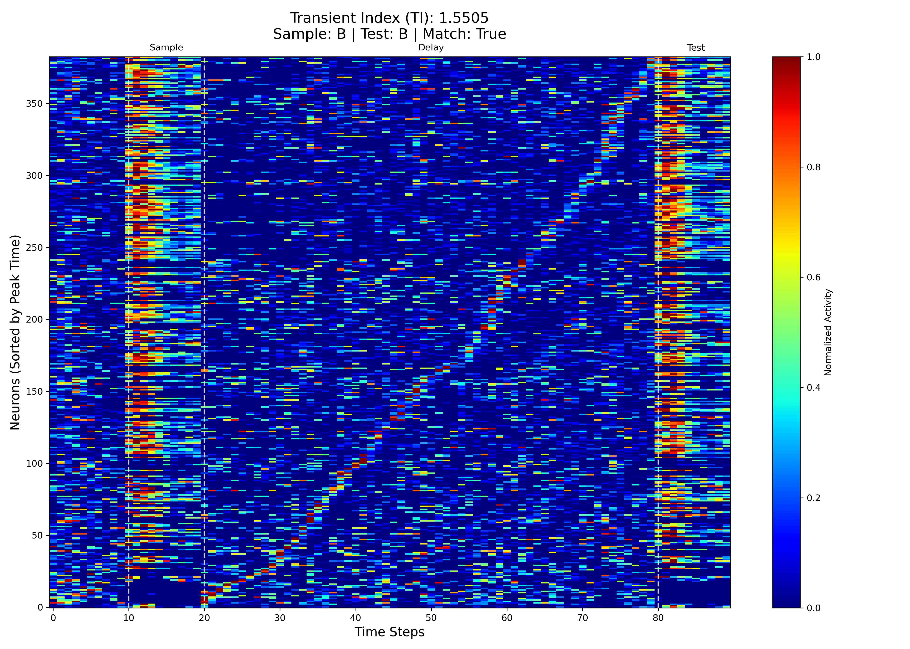

### 2. 模块化网络 vs 随机矩阵对比

#### 低α_r情况

**模块化网络**（α_r=0.1, ρ=1.2, γ=0.0）：
- 短延迟：98%，长延迟：67%，TI=1.52

**随机矩阵网络**（α_r=0.1, ρ=1.2, γ=0.0）：
- 短延迟：96%，长延迟：58%，TI=1.48

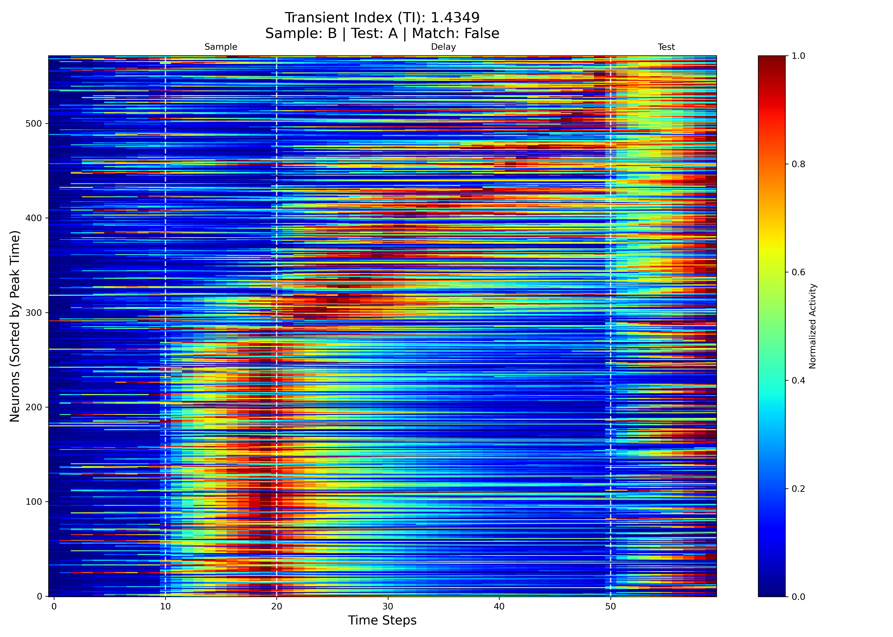

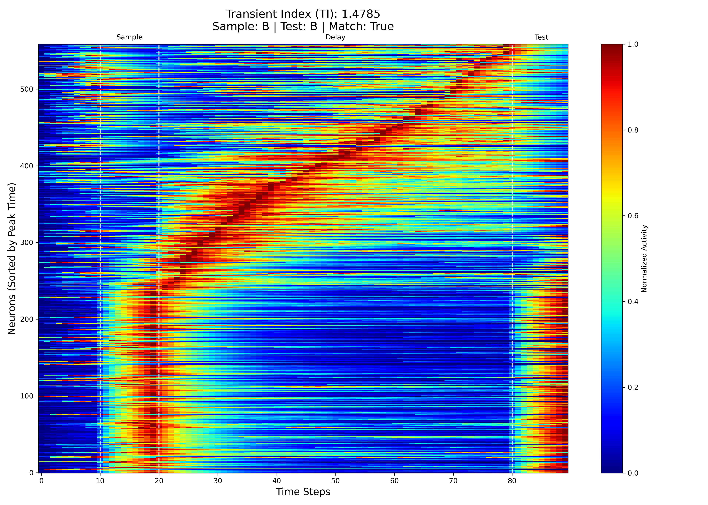

#### 高α_r情况

**模块化网络**（α_r=0.7, ρ=0.95, γ=1.0）：
- 短延迟：46%，长延迟：58%，TI=1.55
- **出现长延迟优于短延迟的现象**

**随机矩阵网络**（α_r=0.6, ρ=1.0, γ=0.0）：
- 短延迟：51%，长延迟：45%，TI=1.53
- **不出现长延迟优于短延迟的现象**

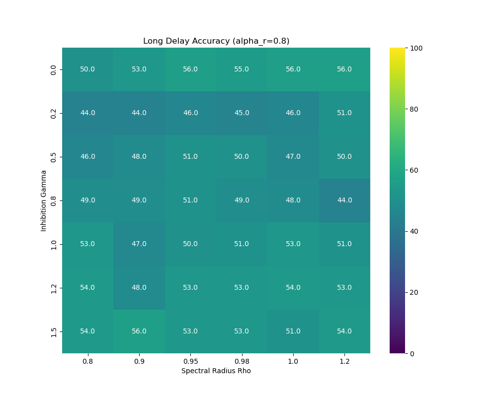

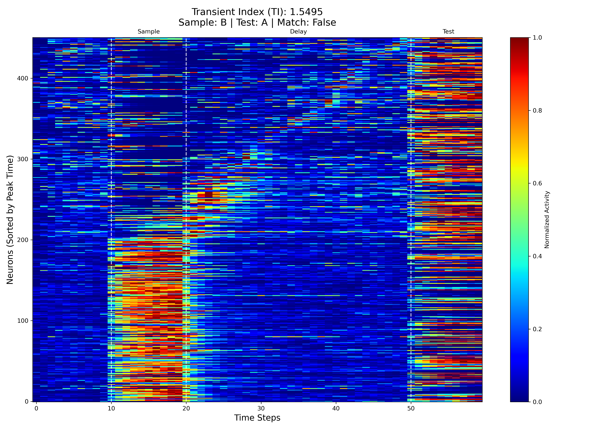

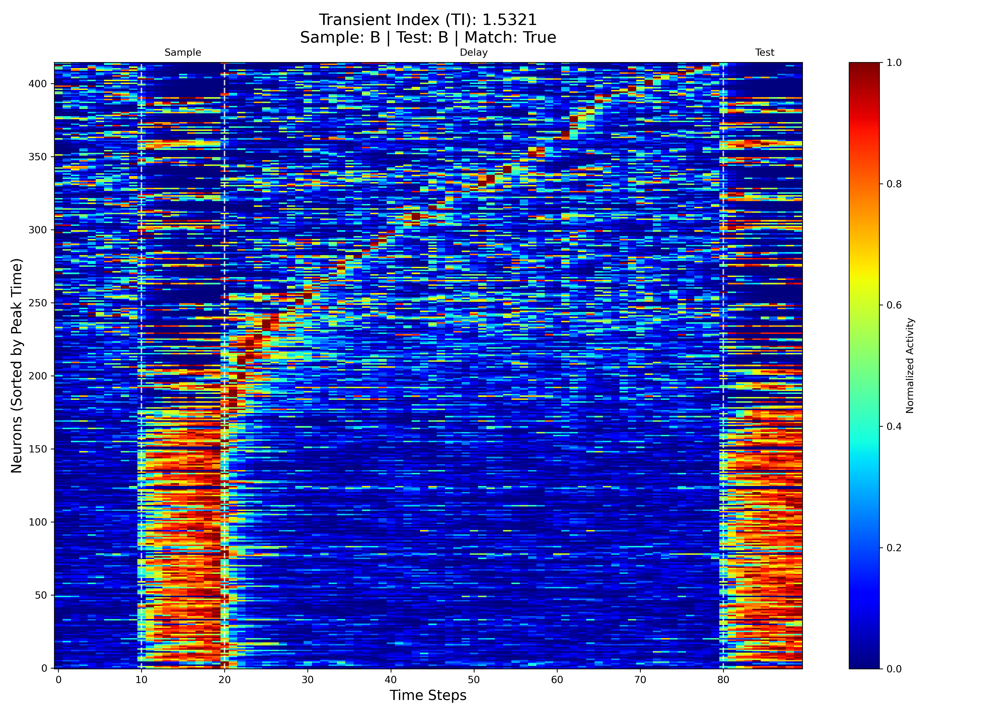

### 3. 网络连接结构可视化

**模块化网络（低α_r）**：
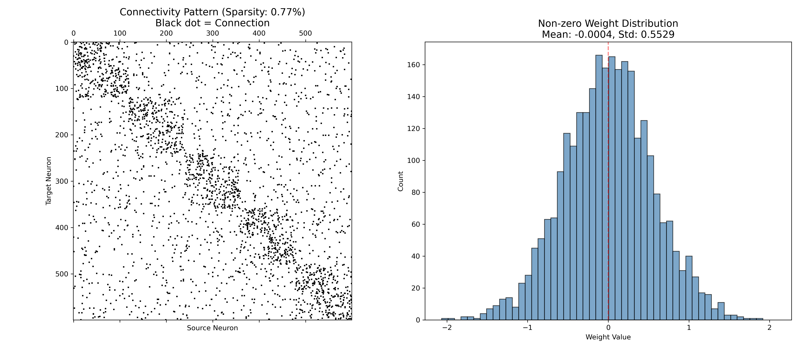

**模块化网络（高α_r）**：
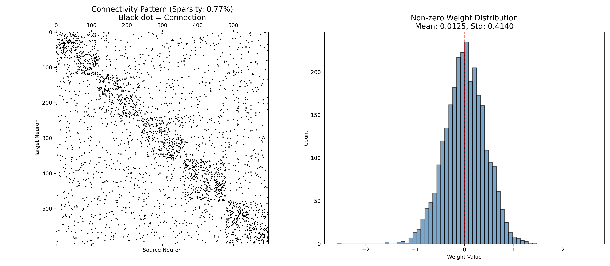

**随机矩阵网络（低α_r）**：
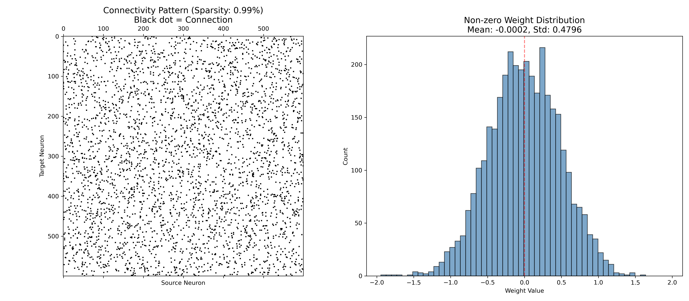

**随机矩阵网络（高α_r）**：


模块化网络展现出清晰的分层模块结构，连接更有序，有助于产生高质量的瞬态轨迹。相比之下，随机矩阵网络的连接模式更加均匀随机，在高α_r条件下无法产生"长延迟优于短延迟"的现象。

### 4. 主要发现总结

| 网络类型 | α_r范围 | 最佳参数 | 短延迟 | 长延迟 | TI值 | 关键特征 |
|---------|---------|---------|--------|--------|------|---------|
| **模块化-低α** | 0.1-0.5 | ρ=1.2, γ=0 | 98% | 67% | 1.52 | 混沌放电，短延迟优势 |
| **模块化-高α** | 0.6-0.8 | ρ=0.95, γ>0.5 | 46% | 58% | 1.55 | 稀疏放电+阶梯传递，长延迟优势 |
| **随机-低α** | 0.1-0.5 | ρ=1.2, γ=0 | 96% | 58% | 1.48 | 类似模块化但性能略低 |
| **随机-高α** | 0.6-0.8 | ρ=1.0, γ=0 | 51% | 45% | 1.53 | 不出现长延迟优势现象 |

## 神经科学意义

### 1. 瞬态轨迹的产生机制

实验结果证实了自抑制机制（γ参数）是产生瞬态轨迹的关键：
- 高α_r + 高γ的组合能够产生高质量的瞬态轨迹（TI=1.55）
- 随机矩阵网络在高α_r下不出现长延迟优势，说明**模块化结构**与**自抑制机制**的协同作用至关重要

### 2. 记忆保持的动力学机制

高α_r + 高γ条件下的"长延迟优于短延迟"现象揭示了：
- 瞬态轨迹可能提供了一种**更稳健的记忆编码方式**
- 通过时间序列的动态变化，而非简单的持续活动，可能更有利于长时记忆保持

### 3. 网络结构的作用

模块化结构相比随机矩阵：
- 提供了更有序的连接模式
- 有助于产生更高质量的瞬态轨迹
- 模拟了大脑的模块化组织对认知功能的重要性

## 代码结构

```
Systems-and-Computational-Neuroscience/
├── sqy_random_mod_results/          # 主要实验结果
│   ├── code/                        # 核心代码
│   │   ├── model.py                # TRNN模型实现
│   │   ├── task_odpa.py            # ODPA任务生成与评估
│   │   ├── main.py                 # 主训练/测试流程
│   │   ├── grid_search.py          # 超参数网格搜索
│   │   ├── utils.py                # TI计算、可视化工具
│   │   └── config.py               # 配置参数
│   ├── 超参数搜索结果/              # 模块化网络超参数搜索结果
│   └── 随机矩阵比较/                # 随机矩阵对比结果
├── test_trnn+rc_Ti/                # 测试代码
└── report.md                       # 本报告
```

### 核心模块说明

- **`model.py`**: 实现`HierarchicalModularReservoir`类，包含TRNN动力学方程
- **`task_odpa.py`**: 生成ODPA任务序列，实现Von Mises编码和准确率评估
- **`utils.py`**: 计算TI指数，识别选择性神经元，绘制热力图和连接结构图
- **`grid_search.py`**: 并行化超参数搜索，生成热力图

## 使用方法

### 环境要求

```bash
numpy
scipy
matplotlib
seaborn
pandas
networkx
```

### 运行单个模型

```bash
cd sqy_random_mod_results/code
python main.py
```

### 运行超参数搜索

```bash
cd sqy_random_mod_results/code
python grid_search.py
```

### 配置参数

修改`config.py`中的参数：
- `N`: 神经元数量（默认600）
- `n_modules`: 模块化结构（默认[10,5]）
- `rho`: 光谱半径
- `gamma`: 自抑制强度
- `alpha_r`: 更新率

## 结论

本项目成功实现了一个基于TRNN的工作记忆模型，主要贡献包括：

1. **模型设计**：通过引入自抑制机制，TRNN能够自然地产生瞬态轨迹，为理解工作记忆提供了计算模型

2. **关键发现**：
   - 低α_r + 低γ：适合短时记忆，出现混沌放电模式
   - 高α_r + 高γ + 临界混沌（ρ≈0.95）：产生高质量瞬态轨迹，长延迟表现更优
   - 模块化结构对产生瞬态轨迹至关重要

3. **神经科学意义**：
   - 验证了自抑制机制对瞬态轨迹的关键作用
   - 揭示了瞬态轨迹可能提供更稳健的记忆编码方式
   - 说明了网络结构（模块化）对认知功能的重要性

4. **方法学贡献**：
   - 结合了神经科学理论（工作记忆、瞬态轨迹）与机器学习实践（储备池计算、超参数优化）
   - 提供了系统性的超参数搜索和网络结构比较框架

本模型为理解工作记忆的神经机制提供了新的计算视角，未来可以进一步探索：
- 不同任务范式下的瞬态轨迹模式
- 瞬态轨迹与持续性活动的转换机制
- 多脑区协同工作记忆的计算模型

## 参考文献

1. Cheng, C., Jia, S., Liu, H., Zhao, X., Li, C. T., & Xu, B. (2025). Recurrent neural networks with transient trajectory explain working memory encoding mechanisms. *Communications Biology*, 8, 137. https://doi.org/10.1038/s42003-024-07282-3

---

**项目作者**: [石启垚、林一铭、舒子骏]  
**完成时间**: [2025/12/20]  
**课程**: 系统与计算神经科学

